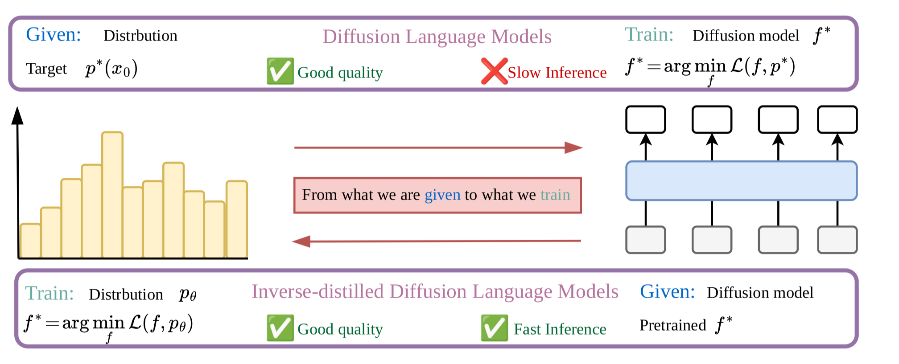

# [IDLM: Inverse-distilled Diffusion Language Models](https://david-cripto.github.io/idlm-project-page/)

<p align="center">
  <strong>By</strong><br>
  <a href="https://david-cripto.github.io/Bio-page/">David Li</a>*,
  <a href="https://scholar.google.com/citations?hl=en&amp;oi=ao&amp;user=UaRTbNoAAAAJ">Nikita Gushchin</a>*,
  <a href="https://scholar.google.com/citations?hl=en&amp;oi=ao&amp;user=h0oeoJkAAAAJ">Dmitry Abulkhanov</a>,
  <a href="https://scholar.google.com/citations?hl=en&amp;oi=ao&amp;user=_XE1LvQAAAAJ">Eric Moulines</a>,
  <a href="https://scholar.google.com/citations?hl=en&amp;oi=ao&amp;user=5kMqBQEAAAAJ">Ivan Oseledets</a>,
  <a href="https://scholar.google.com/citations?hl=en&amp;oi=ao&amp;user=BqDhGJQAAAAJ">Maxim Panov</a>,
  <a href="https://akorotin.netlify.app/">Alexander Korotin</a>
</p>


<p align="center">
  <a href="https://david-cripto.github.io/idlm-project-page/">
    
  </a>

  <a href="https://david-cripto.github.io/Bio-page/blog/idlm/">
    
  </a>
  
  <a href="https://arxiv.org/abs/2602.19066">
    
  </a>
  
  <a href="https://huggingface.co/kekchpek/models">
    
  </a>

  <a href="https://www.youtube.com/watch?v=RZ6_huata1Y&amp;feature=youtu.be">
    
  </a>
  
  <a href="./LICENSE">
    
  </a>
</p>

<div align="center">
  
</div>


## What is IDLM?

Diffusion Language Models can generate high-quality text, but their iterative reverse-diffusion sampling makes inference slow. **IDLM** speeds them up by distilling a pretrained many-step diffusion language model into a **few-step generator**.

Instead of simply matching every teacher step, IDLM uses an [Inverse Distillation](https://arxiv.org/abs/2502.01362) view for discrete token spaces.The paper reports **4×–64× fewer inference steps** while preserving the teacher model’s generation quality.

---

## Repository layout

```text
IDLM/
├── configs/                 # Hydra configs: data, model, algo, strategy, callbacks, etc.
│   ├── algo/                # ar, mdlm, duo, duo_base, d3pm, sedd
│   ├── data/                # OpenWebText and TinyGSM/GSM8K configs
│   │   ├── tiny-gsm.yaml    # TinyGSM training/evaluation data config
│   │   └── gsm8k-test.yaml  # GSM8K/TinyGSM benchmark evaluation config
│   ├── model/               # tiny / small / medium model configs
│   ├── noise/               # diffusion noise schedules
│   └── config.yaml          # main experiment config
├── integral/                # precomputed tokenizer / integration assets, including SmolLM TinyGSM support
├── models/                  # DiT backbone, EMA utilities, attention tests
├── scripts/                 # training and generation recipes
├── algo.py                  # model families and IDLM distillation logic
├── dataloader.py            # tokenizers, OpenWebText/TinyGSM datasets, dataloaders
├── main.py                  # Hydra + Lightning entry point
├── metrics.py               # perplexity, entropy, BPD, NLL metrics
├── trainer_base.py          # shared training / sampling base classes
├── utils.py                 # logging and helper utilities
├── requirements.txt         # environment note / dependency list
└── LICENSE
```

---

## Getting Started
<a name="getting_started"></a>

### 1. Clone the repository

```bash
git clone https://github.com/David-cripto/IDLM.git
cd IDLM
```

### 2. Create an environment

To get started, create a conda environment containing the required dependencies.

```bash
conda create -n idlm python=3.12
conda activate idlm
conda install nvidia/label/cuda-12.4.0::cuda-toolkit
pip install -r requirements.txt
pip install flash_attn==2.7.4.post1
```

---
## Checkpoints
<a name="checkpoints"></a>

* **IDLM-MDLM**. Trained on OpenWebText:
  * [Huggingface](https://huggingface.co/kekchpek/idlm-mdlm)🤗.
* **IDLM-MDLM**. Trained on TinyGSM:
  * [Huggingface](https://huggingface.co/kekchpek/idlm-mdlm-tynigsm)🤗.
* **IDLM-Duo**. Trained on OpenWebText:
  * [Huggingface](https://huggingface.co/kekchpek/idlm-duo)🤗.
* **IDLM-Duo**. Trained on TinyGSM:
  * [Huggingface](https://huggingface.co/kekchpek/idlm-duo-tynigsm)🤗.
* **IDLM-DCD**. Trained on OpenWebText:
  * [Huggingface](https://huggingface.co/kekchpek/idlm-dcd)🤗.

---

## Train IDLM

This section provides reference training entry points for unconditional OpenWebText distillation and conditional TinyGSM distillation. The scripts are written as Hydra override recipes, update the dataset cache and checkpoint paths before launching a run.

### Unconditional OpenWebText Distillation

The OpenWebText recipes train IDLM students for unconditional language generation. Before executing the scripts, configure the `cache_dir` parameter in `configs/data/openwebtext-split.yaml` to specify the desired output path.

#### MDLM teacher → IDLM-MDLM student

```bash
bash scripts/train_idlm_mdlm.sh
```

#### DUO teacher → IDLM-Duo student

```bash
bash scripts/train_idlm_duo.sh
```

#### DCD teacher → IDLM-DCD student

```bash
bash scripts/train_idlm_dcd.sh
```

### Conditional TinyGSM Distillation

The TinyGSM recipes train IDLM students for conditional mathematical reasoning on TinyGSM-style question-answer examples. Before executing the scripts, configure `cache_dir` in `configs/data/tiny-gsm.yaml` and replace the `training.finetune_path` placeholder in each script with the corresponding pretrained teacher checkpoint. Our TinyGSM distillation runs use the teacher checkpoints from the [S-FLM repository](https://github.com/jdeschena/s-flm): [MDLM](https://huggingface.co/jdeschena/s-flm/blob/main/tinygsm/mdlm.ckpt) for IDLM-MDLM and [Duo](https://huggingface.co/jdeschena/s-flm/blob/main/tinygsm/duo.ckpt) for IDLM-Duo.

#### MDLM teacher → IDLM-MDLM TinyGSM student

```bash
bash scripts/train_idlm_mdlm_tynigsm.sh
```

#### DUO teacher → IDLM-Duo TinyGSM student

```bash
bash scripts/train_idlm_duo_tynigsm.sh
```

---

## Evaluation

This section separates unconditional OpenWebText generation from conditional TinyGSM benchmark evaluation.

### Unconditional OpenWebText Evaluation

The generation scripts sweep over 4, 8, 16, and 32 sampling steps.

Before running them, set `eval.generated_samples_path` to a real JSON output path.

#### IDLM-MDLM checkpoint

```bash
mkdir -p samples

python -m main \
  mode=sample_eval \
  loader.batch_size=2 \
  loader.eval_batch_size=8 \
  data=openwebtext-split \
  algo=mdlm \
  algo.backbone=hf_dit \
  eval.checkpoint_path=kekchpek/idlm-mdlm \
  sampling.steps=16 \
  sampling.num_sample_batches=10 \
  sampling.predictor=ancestral_cache \
  sampling.noise_removal=ancestral \
  +wandb.offline=true \
  eval.generated_samples_path=samples/idlm_mdlm_16steps.json
```

#### IDLM-Duo checkpoint

```bash
mkdir -p samples

python -m main \
  mode=sample_eval \
  loader.batch_size=2 \
  loader.eval_batch_size=8 \
  data=openwebtext-split \
  algo=duo \
  algo.backbone=hf_dit \
  eval.checkpoint_path=kekchpek/idlm-duo \
  sampling.steps=16 \
  sampling.num_sample_batches=10 \
  sampling.noise_removal=greedy \
  +wandb.offline=true \
  eval.generated_samples_path=samples/idlm_duo_16steps.json
```

#### IDLM-DCD checkpoint

```bash
mkdir -p samples

python -m main \
  mode=sample_eval \
  loader.batch_size=2 \
  loader.eval_batch_size=8 \
  data=openwebtext-split \
  algo=duo \
  algo.backbone=hf_dit \
  eval.checkpoint_path=kekchpek/idlm-dcd \
  sampling.steps=4 \
  sampling.num_sample_batches=10 \
  sampling.noise_removal=greedy \
  +wandb.offline=true \
  eval.generated_samples_path=samples/idlm_duo_4steps.json
```

#### Run the provided scripts

```bash
bash scripts/generation_idlm_mdlm.sh
bash scripts/generation_idlm_duo.sh
bash scripts/generation_idlm_dcd.sh
```

Generated sample files contain:

```json
{
  "generative_ppl": 0.0,
  "entropy": 0.0,
  "generated_seqs": []
}
```

### Conditional TinyGSM Evaluation

We release the TinyGSM IDLM checkpoints on Hugging Face: [IDLM-MDLM TinyGSM](https://huggingface.co/kekchpek/idlm-mdlm-tynigsm) and [IDLM-Duo TinyGSM](https://huggingface.co/kekchpek/idlm-duo-tynigsm). To evaluate these conditional models on the TinyGSM benchmark, use the `.ckpt` files from the Hugging Face repositories together with the TinyGSM evaluation code from the [S-FLM repository](https://github.com/jdeschena/s-flm).

---

## Outputs

By default, Hydra writes experiment outputs under:

```text
outputs/<dataset>/<date>/<time>/
```

TensorBoard logs are written under:

```text
tb_logs/
```

Checkpoints are written according to the checkpointing config in `configs/config.yaml`.

---

## Citation

If you find this repository useful, please cite:

```bibtex
@article{li2026idlm,
  title={IDLM: Inverse-distilled Diffusion Language Models},
  author={Li, David and Gushchin, Nikita and Abulkhanov, Dmitry and Moulines, Eric and Oseledets, Ivan and Panov, Maxim and Korotin, Alexander},
  journal={arXiv preprint arXiv:2602.19066},
  year={2026}
}
```

---

## Acknowledgements

Our codebase is inspired by recent Discrete Diffusion Models projects. Namely, [MDLM](https://github.com/kuleshov-group/mdlm), [Duo](https://github.com/s-sahoo/duo), and [S-FLM](https://github.com/jdeschena/s-flm).

---

## License

This project is released under the MIT License. See [`LICENSE`](LICENSE) for details.
